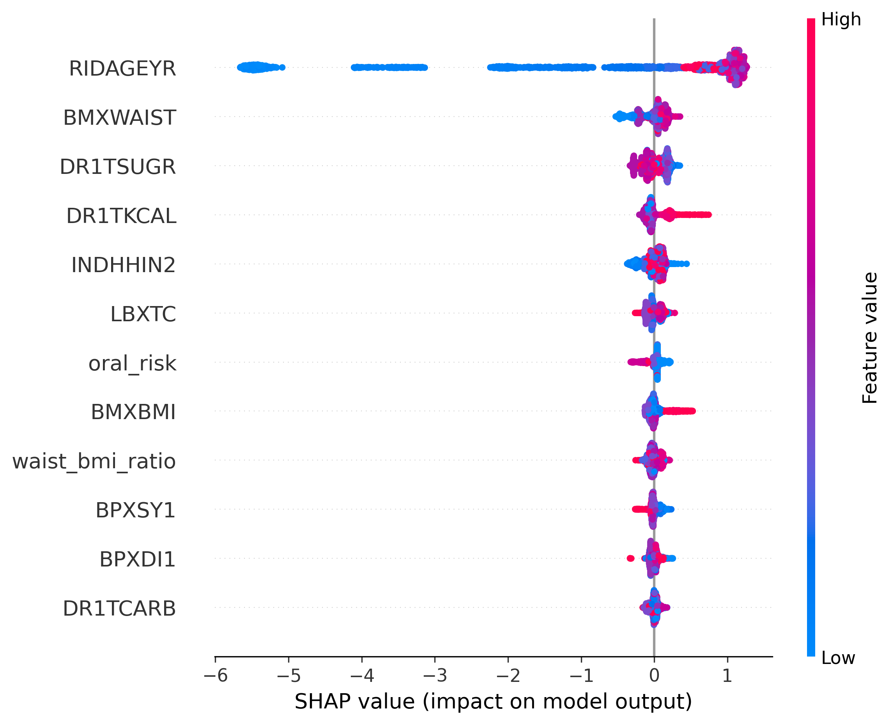
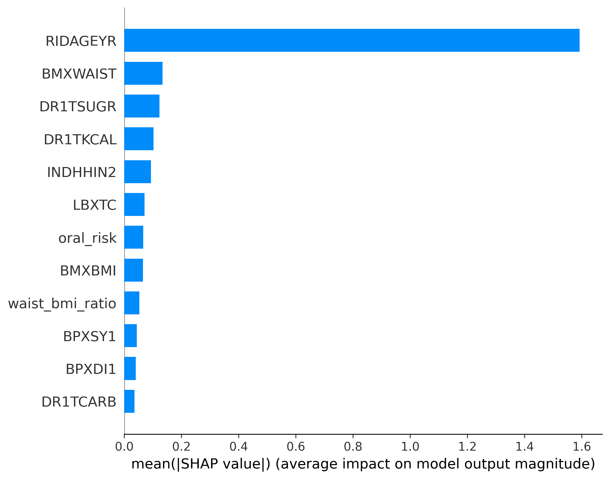

# Dental Cavity Risk Prediction using NHANES Data

## Overview

This project develops an explainable machine learning system to predict dental cavity risk using population-level health data from NHANES. The goal is to combine predictive modeling with clinically interpretable insights using SHAP-based explainability.

The model identifies individuals at higher risk of dental caries using demographic, behavioral, dietary, and metabolic features.

---

## Problem Statement

Dental caries is a multifactorial condition influenced by behavioral, dietary, and socioeconomic factors. This project aims to build a predictive model that can capture these relationships and provide interpretable risk insights.

---

## Dataset

The dataset is derived from NHANES (National Health and Nutrition Examination Survey), a large-scale US public health dataset.

### Features include:
- Demographics: age, income, education, ethnicity  
- Dietary intake: sugar, calories, carbohydrates  
- Clinical measures: BMI, waist circumference, blood pressure, cholesterol  
- Oral health behavior indicators  
- Engineered features: oral risk score, waist-to-BMI ratio  

### Target:
- `has_cavity`: binary indicator of dental caries presence

---

## Data Processing

- Missing values handled using median/mode imputation  
- Invalid NHANES codes removed  
- Skewed distributions log-transformed  
- Outliers winsorized  
- One-hot encoding applied to categorical variables  
- Feature engineering for behavioral and metabolic risk patterns  

---

## Model Development

Two models were trained:

- Logistic Regression (baseline model)
- XGBoost Classifier (final model)

A stratified train-test split was used to preserve class distribution.

---

## Model Performance

Final XGBoost model achieved:

- ROC-AUC: ~0.85  
- Accuracy: ~0.78  
- F1 Score: ~0.82  

The model significantly outperforms baseline approaches, demonstrating strong predictive capability.

---

## Feature Importance

Most influential predictors:

- Age (RIDAGEYR)
- Waist circumference (BMXWAIST)
- Sugar intake (DR1TSUGR)
- Caloric intake (DR1TKCAL)
- Income (INDHHIN2)

Engineered features provided additional but weaker predictive signal compared to primary variables.

---

## Explainability (SHAP Analysis)

SHAP was used to interpret model predictions.

### Global Insights

- Age is the strongest predictor of cavity risk  
- Higher waist circumference increases predicted risk  
- Sugar intake contributes positively to risk  
- Socioeconomic status (income) has measurable impact  
- Dietary variables are weaker but consistent contributors  

### Key Insight

The model reflects established epidemiological patterns where dental caries risk is primarily driven by cumulative exposure (age), with behavioral and metabolic factors acting as secondary modifiers.

---

## Clinical Validation

Feature engineering and model interpretation were reviewed with input from dental health professionals to ensure alignment with established clinical understanding of dental caries risk factors.

This domain input helped validate key assumptions regarding dietary behavior, oral hygiene, and socioeconomic influence.

---

## Visualizations

### SHAP Summary Plot

### SHAP Feature Importance

---

## Tools & Technologies

- Python  
- Pandas, NumPy  
- Scikit-learn  
- XGBoost  
- SHAP  
- Matplotlib  

---

## Key Takeaways

- End-to-end machine learning pipeline on real healthcare data  
- Strong predictive performance with ROC-AUC ~0.85  
- High interpretability using SHAP  
- Clinically aligned feature engineering and validation  
- Demonstrates real-world application of ML in healthcare risk modeling  

---

## Notes

- Dietary variables may contain recall bias inherent in NHANES self-reported data  
- Engineered features improve interpretability more than raw predictive gain  
